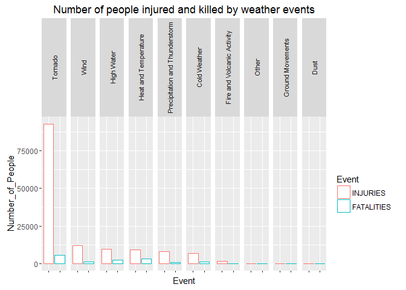

Analysis of economic and public health consequences of severe weather events in US
----------------------------------------------------------------------------------

Final project for Reproducible Research course on Coursera (5th course
of the data analysis specialization).

### Synopsis

This project analyses the U.S. National Oceanic and Atmospheric
Administration's (NOAA) storm database. This database tracks
characteristics of major storms and weather events in the United States,
including when and where they occur, as well as estimates of any
fatalities, injuries, and property damage.

According to the findings, Tornado, Wind and High Water are responsible
for the biggest economic losses. In absolute dollars, the property
damage is bigger than the crops damage across all events except Heat and
Tempreture events. Tornados also have the most dramatic negative impact
on public health: they are responsible for twice as many injuries as all
other weather conditions combined.

### Data Processing

Download storm.RData file with variable *storm* if we have it in the
working directory. If not - loading and reading the data in *storm*
variable. Notice that read.csv function allows us to read a compressed
file.

    storm <- 0
    # check if storm variable already exists
    if (file.exists("storm.RData")){
          load("storm.RData")
    } else {
          if (!file.exists("storm.bz2")) {
                url <- "https://d396qusza40orc.cloudfront.net/repdata%2Fdata%2FStormData.csv.bz2"
                download.file(url, destfile= "storm.bz2")
          }
          storm <- read.csv("storm.bz2")
          save(storm, file="storm.RData")
    }

Remove all unwanted columns so that we have only variables related to
public health, economic losses and names of the events.

    subData <- storm[,c("EVTYPE", "FATALITIES", "INJURIES", "PROPDMG", "CROPDMG")]

Also delete rows with "?" and summaries in the event name column
"EVTYPE".

    # Delete the row with "?" in the EVTYPE column
    subData <- subData[!(subData$EVTYPE == "?"),]
    # Remove summaries
    subData <- subData[!(grepl('Summary', subData$EVTYPE, ignore.case = TRUE)),]

Now let's unite 985 unique values of events into meaningfull groups.

    subData$EVTYPE <- as.character(subData$EVTYPE)

    oldToNewNames = list()

    oldToNewNames[paste("cold|cool|ice|icy|frost|freeze|snow|winter|wintry|wintery|blizzard|chill|freezing|",
                  "glaze|sleet", sep = "")] <- "Cold Weather"

    oldToNewNames[paste("warmth|DRIEST MONTH|warm|heat|dry|hot|drought|thermia|temperature record|",
                  "record temperature|record high|temperature", sep = "")] <- "Heat and Temperature"

    oldToNewNames["wind|storm|wnd|waterspouts|waterspouts/"] <- "Wind"

    oldToNewNames[paste("precipitation|MIXED PRECIP|rain|hail|drizzle|LIGNTNING|HEAVY SHOWER|LIGHTNING|TSTM",
                  "LIGHTING|HEAVY SHOWER[S]|HEAVY PRECIPATATION|wet|percip|burst|[fv]og|wall cloud", sep="")
                 ] <-"Precipitation and Thunderstorm"

    oldToNewNames["hurricane|typhoon|tornado|TORNDAO|funnel|whirlwind"] <- "Tornado"

    oldToNewNames["dust|GUSTNADO|saharan|landspout"] <- "Dust"

    oldToNewNames[paste("seas|high water|fld|fldg|dam|water|SURGE|SEICHE|SWELLS|tide|tsunami|wave|current|",
                  "surf|marine|drowning|flood|DAM FAILURE|WATERSPOUT|WATER SPOUT|WAYTERSPOUT", sep="")
                 ] <- "High Water"

    oldToNewNames["ash|smoke|volcanic|fire"] <- "Fire and Volcanic Activity"

    oldToNewNames["slide|erosion|EROSIN|landslump"] <- "Ground Movements"

    for (oldName in names(oldToNewNames)) {
          subData[grepl(oldName, subData$EVTYPE, ignore.case = TRUE), "EVTYPE"] <- oldToNewNames[[oldName]]
    }

    subData[!grepl(paste("Heat and Temperature|Wind|Tornado|Dust|Precipitation and Thunderstorm|Cold Weather",
                         "|High Water|Ground Movements|Fire and Volcanic Activity", sep = ""), 
                   subData$EVTYPE), "EVTYPE"] <- "Other"

### Data Analysis

First, let's explore which types of events (as indicated in the EVTYPE
variable) are most harmful with respect to population health. In order
to do that, we aggregate and sort data about injuries and fatalities by
the new categories. The end result is the variable "HHarmSubData" which
stands for human harm sub data.

    stopifnot(require("dplyr"))

    ## Warning: package 'dplyr' was built under R version 3.2.4

    ArrangedSubData <- aggregate(cbind(INJURIES, FATALITIES) ~ EVTYPE, data = subData, FUN = sum)
    HHarmSubData <- ArrangedSubData[order(ArrangedSubData$INJURIES, decreasing = T),]
    HHarmSubData$EVTYPE <- factor(HHarmSubData$EVTYPE, levels=(HHarmSubData$EVTYPE))

Now the second question. Across the United States, which types of events
have the greatest economic consequences? We go through the same set of
commands to create aggregated, sorted economic harm data EHarmSubData.

    EHarmSubData <- aggregate(cbind(PROPDMG, CROPDMG) ~ EVTYPE, data = subData, FUN = sum)
    EHarmSubData <- EHarmSubData[order(EHarmSubData$PROPDMG, decreasing = T),]
    EHarmSubData$EVTYPE <- factor(EHarmSubData$EVTYPE, levels=(EHarmSubData$EVTYPE))

### Results

Lets look at at the resulting data.

    HHarmSubData

    ##                            EVTYPE INJURIES FATALITIES
    ## 9                         Tornado    92743       5769
    ## 10                           Wind    12302       1324
    ## 6                      High Water     9636       2354
    ## 5            Heat and Temperature     9276       3197
    ## 8  Precipitation and Thunderstorm     7984       1015
    ## 1                    Cold Weather     6706       1125
    ## 3      Fire and Volcanic Activity     1608         90
    ## 7                           Other      175        225
    ## 4                Ground Movements       55         44
    ## 2                            Dust       43          2

    EHarmSubData

    ##                            EVTYPE    PROPDMG   CROPDMG
    ## 9                         Tornado 3241129.51 111654.51
    ## 10                           Wind 3211999.53 230237.66
    ## 6                      High Water 2479896.16 366799.73
    ## 8  Precipitation and Thunderstorm 1365934.06 597941.27
    ## 1                    Cold Weather  424927.68  25158.66
    ## 3      Fire and Volcanic Activity  125818.29   9565.74
    ## 4                Ground Movements   21629.04     37.00
    ## 5            Heat and Temperature    9069.51  35396.80
    ## 7                           Other    3243.05   1034.40
    ## 2                            Dust     848.18      1.55

Let's look at the graphical representation of the results.

    # Load required packages
    stopifnot(require("ggplot2")) # package for the graphs

    ## Loading required package: ggplot2

    library(reshape2)  # package for melt function

    HHarmSubData %>% melt(id.vars = "EVTYPE", variable.name = "Event", value.name = "Number_of_People") %>%
          ggplot(aes(x = Event, y = Number_of_People, col = Event)) +
          geom_bar(stat = "identity", fill = "white") + 
          facet_wrap( ~ EVTYPE, nrow = 1) + theme(axis.text.x = element_blank(), 
          strip.text.x = element_text(angle = 90, size=8, hjust = .5, vjust = .5)) +
          ggtitle("Number of people injured and killed by weather events")

Injuries from tornados are overwhelmingly high. Let's calculate the
ratio of number of people injured during tornados to the number of
people injured during all other weather events.

    HHarmSubData[1,2]/sum(HHarmSubData[2:7,2])

    ## [1] 1.951991

As we can see, the number of people injured during tornados is twice as
high as the number of people injured during all other weather conditions
combined. Number of fatalities is also the biggest between all other
groups of events.

Now to the economic losses.

    EHarmSubData %>% melt(id.vars = "EVTYPE", variable.name = "Event", value.name = "Economic_Loss") %>%
          ggplot(aes(x = Event, y = Economic_Loss/1e+6, col = Event)) +
          geom_bar(stat = "identity", fill = "white") + 
          facet_wrap( ~ EVTYPE, nrow = 1) + theme(axis.text.x = element_blank(), 
          strip.text.x = element_text(angle = 90, size=8, hjust = .5, vjust = .5)) +
          ggtitle("Economic losses by weather events") + ylab("Economic Losses in millions")

    EHarmSubData[,"PROPDMG"] > EHarmSubData[,"CROPDMG"]

    ##  [1]  TRUE  TRUE  TRUE  TRUE  TRUE  TRUE  TRUE FALSE  TRUE  TRUE

Three most damaging groups of events in terms of economic losses are
Tornado, Wind and High Water respectively. The most damaging events for
the crops are precipitation and thunderstorm And in terms of costs,
property damage is much more expensive than the damage to the crop in
all cases except Heat and Temperature events.
